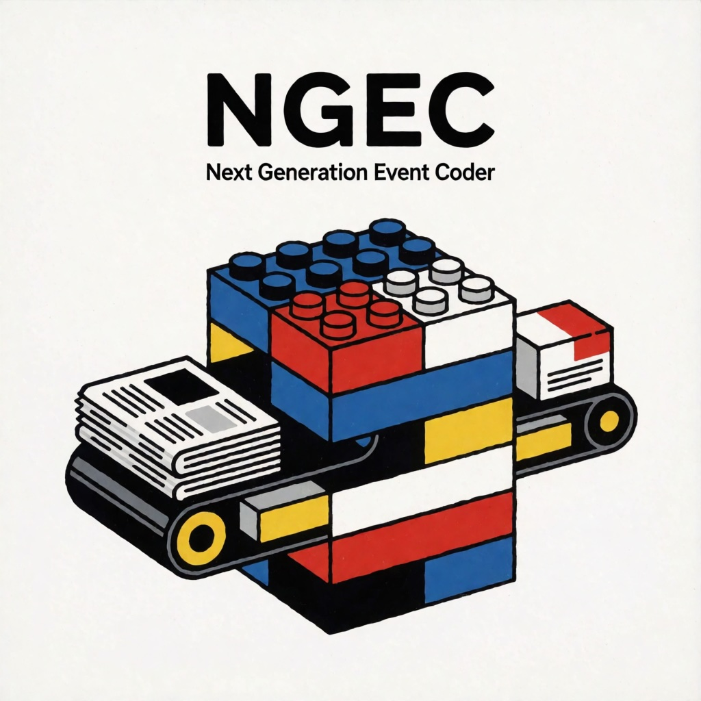

# NGEC



NGEC (Next Generation Event Coder) turns news stories into political event
data. For each story, it finds the events it describes, either using the
[PLOVER](https://github.com/openeventdata/PLOVER) event ontology, or a custom
ontology you've developed.

It identifies instances of events reported in text (protests,
assaults, requests, etc.). Then, for each event, it extracts the actor and
recipient, when and where it happened, and optionally, other attributes like 
how many people were killed or
injured in the event. It then classifies these entities PLOVER categories (government, military,
civilians, ...) and links them to Wikipedia. It resolves the date to a calendar
date and the location to a place in GeoNames. A much earlier version of this
pipeline produced the [POLECAT](https://dataverse.harvard.edu/dataverse/POLECAT) dataset.

- [Quickstart](#quickstart)
- [Letting a coding agent set it up](#letting-a-coding-agent-set-it-up)
- [Coding your own stories](#coding-your-own-stories)
- [Before coding a corpus](#before-coding-a-corpus)
- [When something goes wrong](#when-something-goes-wrong)
- [More documentation](#more-documentation)

## Quickstart

You need:

- [uv](https://docs.astral.sh/uv/getting-started/installation/), which installs
  Python and NGEC. See [`docs/INSTALL.md`](docs/INSTALL.md#installing-with-pip) for
  instructions on installing with pip.
- [Docker](https://www.docker.com/get-started/), which runs Elasticsearch, the
  search engine that holds NGEC's copy of Wikipedia and of the GeoNames
  gazetteer.
- About 20 GB of free disk space and an hour, mostly waiting for downloads.

Then, in a terminal:

```shell
uv init --python 3.12 my-ngec          # make a new project folder
cd my-ngec
# download this repo and install
uv add "ngec[cpu,llamacpp] @ git+https://github.com/ahalterman/ngec-2025"
uv run ngec download-models            # download about 4 GB of models
uv run ngec download-index --start     # 11.6 GB index; starts Elasticsearch in Docker
uv run ngec doctor --smoke             # checks everything, then codes three stories
```

By default, `ngec[cpu,llamacpp]` installs a version optimized for
laptops without an Nvidia GPU. This is fine for testing, but for better
speed, you should plan to run on a computer with a GPU or on a recent Mac.
To install the versions for those systems, change the options in brackets 
using the table below:

| Your computer | Install |
|---|---|
| No NVIDIA GPU (most laptops, Windows or Linux) | `ngec[cpu,llamacpp]` |
| Mac with Apple Silicon (M1 or newer) | `ngec[mlx]` |
| Linux with an NVIDIA GPU | `ngec[cu12,vllm]` |
| Windows with an NVIDIA GPU | `ngec[cu12,llamacpp]` |

What the commands do:

- **`ngec download-models`** downloads the language models NGEC uses (spaCy,
  three sentence encoders, and the model that extracts event attributes) into
  your user cache so that NGEC starts up quickly when you first run it.
- **`ngec download-index --start`** downloads the Wikipedia and GeoNames index to
  `~/ngec-es-data`, checks it, unpacks it, and starts Elasticsearch on it on
  port 9200. It is the slowest step, so you can run it in a second terminal
  while `download-models` runs. If the download is interrupted, run it again and
  it carries on where it stopped. Elasticsearch keeps running in Docker after
  you close the terminal, and starts again with Docker after a reboot.
- **`ngec doctor --smoke`** checks the installation and then codes three news
  stories. It takes a few minutes on a laptop. If it prints events, then you've
  installed everything correctly!

**Not everything needs Elasticsearch.** The Elasticsearch indices are the heavy 
lift for setup, but only geocoding and Wikipedia-based actor
resolution use it. If you only need event types, the extracted attribute text,
date resolution or actor categories, skip `download-index`.
[`docs/INSTALL.md`](docs/INSTALL.md#do-you-need-all-of-it) has more details
on which downloads you'll need for each.

## Vibe setup with a coding agent

If you use Claude Code, Codex or another coding agent, it can do the installation
for you. Open it in an empty folder and ask it to:

> Install NGEC in this folder, following
> https://raw.githubusercontent.com/ahalterman/ngec-2025/main/ngec/assets/guide/setup.md

That guide is written for agents. It tells them to use `ngec doctor` to
find what is missing, to install only what your goal needs and to ask you before
running each fix. It'll still ask you to install system software such as Docker.

Once NGEC is installed, run this in your project folder:

```shell
uv run ngec guide --init
```

This adds a short section to the project's `AGENTS.md` (creating it if needed)
that tells any agent working there to read NGEC's guide first. The guide comes
with the package, so it always matches the version you have installed. It covers
installing, coding a corpus, using single steps, and using your own actor
categories, event definitions or classifier.

Codex and most other agents read `AGENTS.md` on their own. Claude Code reads it
when the folder has no `CLAUDE.md`. If yours has one, add a line to it that
says `@AGENTS.md`.

## Coding your own stories

Here's an example of how to code stories using the built-in PLOVER ontology. If you
want to code different kinds of events, see the Customizing section. [TODO]

Each story needs an `id`, the `event_text`, and a `pub_date`, which is used to
resolve relative dates like "today" or "last Tuesday":

```python
from ngec import events_to_table
from ngec.es_client import es_client_from_env
from ngec.logging import quiet_third_party_loggers
from ngec.plover_coder import PloverCoder

quiet_third_party_loggers()

coder = PloverCoder(es_client=es_client_from_env())

stories = [
    {"id": "story1",
     "event_text": "Protesters were in the streets in Paris again today to protest "
                   "against the government's austerity measures.",
     "pub_date": "2016-05-01"},
]
events = coder.process(stories)

# create a simplified table output
table = events_to_table(events)
table.to_csv("events.csv", index=False)
```

Save it as a file in your project folder (e.g. `code_events.py`) and run it with
`uv run python code_events.py`. `events.csv` has one row per event.

```
id                story1_PROTEST_demo_0
story_id          story1
pub_date          2016-05-01
event_type        PROTEST
event_mode        demo
anchor_quote      Protesters were in the streets in Paris again today to protest against the government's austerity measures
date_text         today
date              2016-05-01
date_granularity  day
date_type         exact
location_text     Paris
killed_text
injured_text
location_name     Paris
location_country  FRA
location_admin1   Île-de-France
lat               48.85341
lon               2.3488
geonameid         2988507
actor_text        Protesters
actor_code        CVL OPP
actor_wiki
recipient_text    government
recipient_code    GOV
recipient_wiki
```

- **`event_type` and `event_mode`** are the PLOVER event type and its mode
  (here, a demonstration). A story can produce several events. It produces one
  per event type and mode that the classifier detects, and more if the story
  describes more than one such event.
- **`anchor_quote`** is the passage the attribute model identified as the 
  best short span describing the event (though it can identify information
  from elsewhere in the story). `*_text` columns are the exact spans the model identified
  as reporting the actor, recipient, date, and location of the event.
- **`date`** is the resolved calendar date. `date_granularity` is precise
  it is (day, week, month, quarter, year) and `date_type` whether it is exact,
  approximate or a range.
- **`location_`, `lat`, `lon` and `geonameid`** are the GeoNames information for
  the event's location. If the geoparser is not confident, it will leave these blank. 
- **`actor_code`/`recipient_code`** reports the PLOVER actor/recipient categories (here, civilians who are
  opposition, and the government which is GOV), and `actor_wiki`/`recipient_wiki` gives the Wikipedia page when the actor is a
  named person or organization.

`events` itself is a list of Python dictionaries with more detail than the
table, including the classifier's confidence, every place mordecai3 found in
the story, and why each date and location was or wasn't resolved. We recommend
working with the JSON in production.  [`PIPELINE.md`](PIPELINE.md) documents
all of the fields.

## Before coding a corpus

**The event classifiers are demonstration models.** These are not the models
that produced POLECAT. They were trained on Voice of America stories labeled by
an LLM applying the PLOVER codebook. For your own event data, you may want to
train your own; see [`CLASSIFIERS.md`](CLASSIFIERS.md).
`ngec guide customize` shows how to use your own classifier, event definitions
or actor categories.

**Speed.** Most of time it takes to run NGEC comes from the attribute extraction model, which runs
once for each (story, event type) pair. On a desktop CPU, this that is about 4.6
seconds each, so a story with three event types takes about 14 seconds. On a
Linux machine with an NVIDIA GPU (`ngec[cu12,vllm]`), it is many times faster (around 20-40 per second).
You should time a batch of 20 stories before planning a large run.
`ngec guide run` has a script for coding a whole corpus in batches, and
[`RUNNING.md`](RUNNING.md) describes what to expect at scale.

**Single steps.** Each part of the pipeline can be used on its own, e.g. to
resolve date phrases or link names to Wikipedia. See `ngec guide pieces`.

### Reproducibility


The coded output depends on the NGEC version, the attribute model, the event
classifiers, the Wikipedia/GeoNames index, and the backend that runs the model.
You should keep two files with your data to make it replicable: the `uv.lock`
in your project folder, which records the exact NGEC commit and every package
version, and the output of `uv run ngec doctor --json`, which records the
attribute model, your settings and the size of the index. NGEC logs which
backend it chose when it starts. `ngec update` tells you when newer models or a
newer index have been published but won't update unless you pass `--apply`.
Updating mid-project changes the output, so you may want to keep what you
started with.

## When something goes wrong

```shell
uv run ngec doctor
```

This checks the installation in a few seconds, without running the pipeline. It checks
the installed version, the settings NGEC reads, whether PyTorch can use your
GPU, and whether Elasticsearch is running with both indices. Anything it flags
is listed at the bottom with the command that fixes it. `--json` gives the same
report in a form to paste into a
[GitHub issue](https://github.com/ahalterman/ngec-2025/issues).

The most common problem is a PyTorch build that cannot use the GPU, so the
pipeline runs on the CPU, many times more slowly, with no error. The doctor
checks for this.

## More documentation

| File | What it covers |
|---|---|
| [`docs/INSTALL.md`](docs/INSTALL.md) | the install in detail: choosing extras, pip, the models, Elasticsearch on another host, updating, working from a clone |
| [`RUNNING.md`](RUNNING.md) | coding a large corpus: hardware, speed, what can go wrong |
| [`PIPELINE.md`](PIPELINE.md) | each step of the pipeline and the fields it adds |
| [`CLASSIFIERS.md`](CLASSIFIERS.md) | where the event classifiers came from and their limits |
| [`docs/PERFORMANCE.md`](docs/PERFORMANCE.md) | speed measurements, and checking which PyTorch build you have |
| [`elasticsearch/SETUP.md`](elasticsearch/SETUP.md) | how to build the index by hand from a newer Wikipedia dump |
| [`DEVELOPING.md`](DEVELOPING.md) | changing NGEC itself: a clone, tests, retraining |
