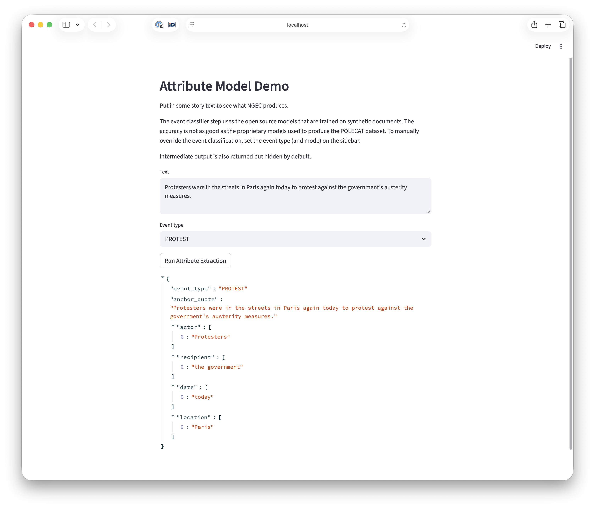
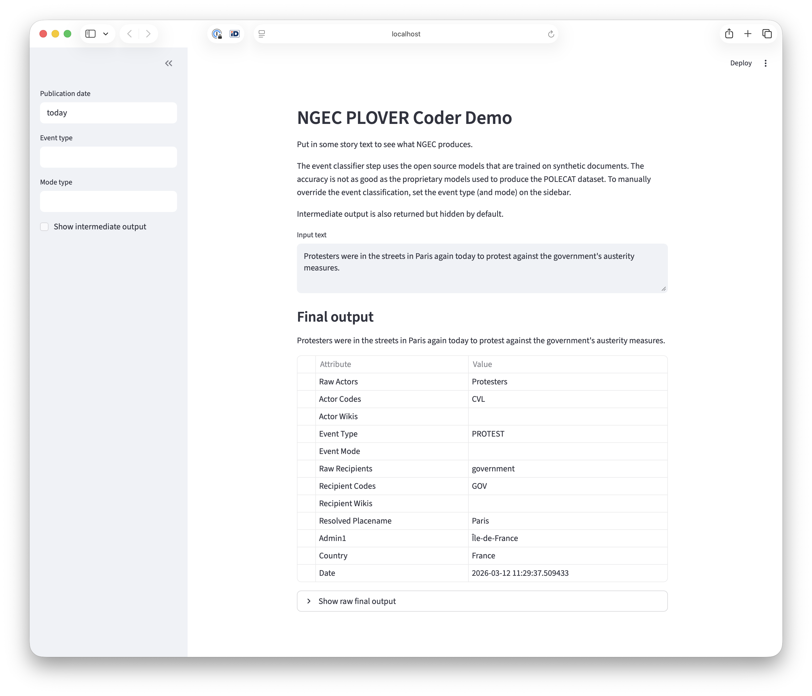

# Examples

This directory contains examples of using parts of the NGEC pipeline on their own. Run them from the top of the repository.

- `demo_wiki_resolution.py`: linking names to Wikipedia and coding actors into PLOVER country and sector codes, without running the rest of the pipeline. Needs Elasticsearch with the `wiki` index.

  ```shell
  uv run python examples/demo_wiki_resolution.py
  ```

- `demo_mordecai.py`: geoparsing a sentence with mordecai3, the geoparser behind NGEC's geolocation step. Needs Elasticsearch with the `geonames` index.

  ```shell
  uv run python examples/demo_mordecai.py
  ```

- `Guardian_SDF_sample.csv.zip`: 249 Guardian stories that mention the SDF, used by `demo_wiki_resolution.py`.

For information on training your own event, mode, and context models, see the `setup` directory.

## Demo apps

Two Streamlit apps, installed with the `demo-app` dependency group.

### Attribute Model

```shell
uv run --group demo-app streamlit run examples/attribute_model_app.py
```



### PLOVER Coder

Runs the whole pipeline on a story you paste in. Needs Elasticsearch.

```shell
uv run --group demo-app streamlit run examples/plover_app.py
```


